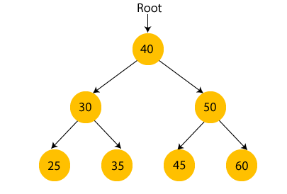

# JavaScript Data Structures

- [JavaScript Data Structures](#javascript-data-structures)
  - [Big O Notaion](#big-o-notaion)
    - [Time Complexity](#time-complexity)
      - [Big O Rules](#big-o-rules)
    - [Space Complexity](#space-complexity)
    - [Performance of Arrays \& Objects](#performance-of-arrays--objects)
  - [Common Problem Solving Patterns](#common-problem-solving-patterns)
    - [1. Frequency Counter](#1-frequency-counter)
    - [2. Multiple Pointers](#2-multiple-pointers)
    - [3. Sliding Window](#3-sliding-window)
    - [4. Divide \& Conquer](#4-divide--conquer)
  - [Searching Algorithms](#searching-algorithms)
  - [Sorting Algorithms](#sorting-algorithms)
    - [1. Elementary / Quadratic Sorting Algorithms](#1-elementary--quadratic-sorting-algorithms)
      - [Bubble Sort](#bubble-sort)
      - [Selection Sort](#selection-sort)
      - [Insertion Sort](#insertion-sort)
    - [2. Intermediate Sorting Algorithms](#2-intermediate-sorting-algorithms)
      - [Merge Sort](#merge-sort)
      - [Quick Sort](#quick-sort)
      - [Radix Sort](#radix-sort)
  - [Data Structures](#data-structures)
    - [Linked Lists](#linked-lists)
      - [Singly Linked List](#singly-linked-list)
      - [Doubly Linked List](#doubly-linked-list)
    - [Stack](#stack)
    - [Queue](#queue)
    - [Trees 🌳🌲🌴](#trees-)
      - [Tree Traversal](#tree-traversal)
      - [Binary Heaps](#binary-heaps)
      - [Priority Queue](#priority-queue)

## Big O Notaion

Relationships between inputs to a function and its runtime, rep `O(f(n))` and is worst case scenario. `f(n)`could be linear`n`, quadratic `n^2`, constant `1` etc.

### Time Complexity

#### Big O Rules

1. Reduce constants to `1`.
2. Exclude smaller terms in the expression.
3. Arithmetic ops are constant.
4. Accessing elements in `array` or `object` by `index` or `key` is constant.
5. Complexity of a loop is its length times whatever's happening inside it.

### Space Complexity

Main focus is on `auxilliary space complexity` which is space required by the algorithm only, not including the inputs to the program.

Some rules:

1. `Primitives` are constant space (`bools`, `null`, `undefined`, `nums`).
2. `String` of lengh `n` requires `O(n)` space.
3. `Reference` types where `n` is length for `arrays` or keys for `objects`, `O(n)` space is used.

### Performance of Arrays & Objects

In objects, `insertion`, `removal` and `access` follow `O(1)`. `Searching` uses `O(n)` - that is searching for a value and not the key. Objects are best when ordering isn't important.

For object `methods`, ([Object.method]), `.keys`, `.values`, `.entries` have a `O(n)`. `.hasOwnProperty` has a `O(1)`.

In arrays, `access` is `O(1)`, `search` `O(n)`. `Insertion` and `deletion` depends on the location to do the operation. Adding & removing to the end is `O(1)`, and to the beginning is `O(n)` due to re-indexing of the rest of elements. Therefore `push` & `pop` are faster than `shift` & `unshift`.

`Concat`, `slice` & `splice` use `O(n)`, and `sort` uses `O(nlogn)`. All array methods use `O(n)`.

## Common Problem Solving Patterns

### 1. Frequency Counter

Makes use of `objects` or `set` to collect values or frequencies of occurance of values in 2 items or arrays to be compared eg anagrams. Helps avoid `O(n^2)` when dealing with arrays and strings by offering `O(n)`.

[Frequency counter example](./02-Solving-Patterns/FrequencyCounter/anagram.js)

### 2. Multiple Pointers

2 or more pointers from either sides of say an array to find a patters. Eg given a sorted array with negatives and positives and the 2 that sums up to 0 is needed. Therefore if sum of pointers is -ve, add 1 to the leftmost. Add 1 to the rightmost otherwise & if 0 return true.

[Multiple pointers example](./02-Solving-Patterns/MultiplePointers/uniqueVals.js)

### 3. Sliding Window

Let the window slide. Instead of redoing similar calculations, find out what is changing in a sequence and do only that calculation. Example is finding the largest sum from a sequence of n consecutive digits in an array.

[Sliding window example](./02-Solving-Patterns/slidingWindow.js)

### 4. Divide & Conquer

We'll see about this :)

## Searching Algorithms

1. Linear Search
   Similar to the ones used in `indexOf()`, `includes()` and the likes. Takes in sorted or unsorted array and loops item to item to find the target.

   [Sample](./04-Search-Algos/linearSearch.js)

2. Binary Search
   Takes a `sorted` array & divides & conquers by picking a pivot - mostly the middle - and determining where the target falls in the 2 arrays. Recursion takes over.

   [Sample](./04-Search-Algos/binarySearch.js)

## Sorting Algorithms

Starting with the inbuilt `sort()`, Passing any array - of numbers or strings - will return the sorted array based on the unicodes. To sort numbers, pass a callback as a parameter. If the callback returns `positive`, the sorting will be in `ascending`. For strings, you can order by length by comparing the lengths and returning as you need.

Check out an [Example](./05-Sorting-Algos/Basics/inbuiltSort.js)

### 1. Elementary / Quadratic Sorting Algorithms

Are the basics with worst and average time complexities of `O(n^2)`. `Insertion` & `Bubble` sorting has a best case of `O(n)` while `Selection` is at `O(n^2)`. They all take constant space.

#### Bubble Sort

Works by swapping adjacent digits if the left is greater than the right. In the first round, the largest digit is taken to the end. The algorithm repeats this until the entire array is sorted or no swaps are made if that is being checked.

Check out an [Example](./05-Sorting-Algos/Basics/bubbleSort.js)

#### Selection Sort

A variable keeps track of the index of the minimum value in the array. This min starts off as the first array element and whenever a new minimum is found while parsing the array, the index of the minimum var is updated. On reaching the end of the array, the `minimum` one is `swapped` with the `first element` in the array.
Then the cycle continues this time starting at the second array element. This might only be superior to `bubble sort` when the number of swaps is of importance and should be minimized.

Check out an [Example](./05-Sorting-Algos/Basics/selectionSort.js)

#### Insertion Sort

Divides the array into 2 parts - the sorted and the unsorted - then loops over the unsorted section and picks each element placing it in its correct position in the sorted part of the array. It therefore starts by taking the `second` element and compares it with the one before and insert where necessary then moves on to the next element. This is repeated until the array is sorted.
This algorithm is best in cases of `online algorithms` where there are new incoming values that were unknown of when the sorting began. They can just be `inserted` where needed.

Check out an [Example](./05-Sorting-Algos/Basics/insertionSort.js)

### 2. Intermediate Sorting Algorithms

Elementaries are not so good with large data sets and therefore these can improve the Big O from `O(n^2)` to `O(n log n)`.

#### Merge Sort

The concept is that an array of 0 or 1 element is already sorted. This therefore decomposes an array to smaller arrays of length 0 or 1 the `merge` them to form a new sorted array.
Recursion is of most importance in this. The code flow has the `recursive` part and the `merging function`. An array is split into `left` and `right` at the middle recursively into arrays of 1s and 0s then merged recursively again.

Check out an [Example](./05-Sorting-Algos/Intermediate/mergeSort.js)

Its Big O is `O(n log n)`. `log n` is from decomposition, i.e, decomposing an array of `8` elements to will take 3 steps, `16` will take 4 steps and so on. Therefore `2 ^ 4 = 16` (log base 2 of 16 is 4). Simple 😅. As for the `n`, in the merging function, comparison is approximately once for every item in both of the arrays being merged.
Space complexity is at `O(n)` - space to store the small arrays increases as the length of the array increases.

#### Quick Sort

Ok, the concept is similar. Divide the array to 1s but in a bit different way. Start by picking a `pivot` - doesn't matter its location - so just go with the first array element. Then go through the entire array keeping track of how many elements are smaller than this pivot. These when encountered are brought to the immediate right of the pivot. On reaching the end of the array, and having a variable holding the number of elements smaller than the pivot, the pivot is swapped that number of places such that it is in its correct position even after sorting - All smaller values are to its left.
Another pivot is choses but this time to the left of the last pivot so the left is sorted then move to the right.

Check out an [Example](./05-Sorting-Algos/Intermediate/quickSort.js)

The Big O is `O(n log n)` but can got to worst case of `O(n^2)` when the pivot is the minimum or maximum value each time. This can be avoided by not picking the first or last element as pivot and try to pick the middle or just a random one. Space complexity is `O(log n)`.

#### Radix Sort

Unlike all previous algorithms that sort based on comparisons on the numbers in the list, `radix` makes the sorting based on a concept of numbers that those with most digits are bigger than the few digit numbers. Also keeps the number order in place like 8 is of cause larger than 3. All numbers in the array are grouped together based on the `LSB` or Least significant digit at the 1s place value. They are then sorted based on how each of these digits follow each other.
The cycle is repeated on the 10th place value until the highest place value a value in the array has where it stops. At this point the array will be sorted.

Check out an [Example](./05-Sorting-Algos/Intermediate/radixSort.js)

The Big O is approximately `O(nk)` where `n` is the array length and `k` is the average number of digits in all the numbers in the array. Though a different concept relating to how computers store numbers pushes the Big O to around `O(n log n)`, but more about than later :).

## Data Structures

### Linked Lists

Is a data struct with a `head`, `tail` & `length`. It is made up of `nodes` each with a `value` and `pointer` to the next node || `null`. You can't randomly access a node - have to start from the first (or last for `doubly linked lists`) to get to the desired node. This is best for insertions & deletions as no `re-indexing` of nodes is involved as it is in the case of arrays.

#### Singly Linked List

The current node holds a pointer to the next node.

```js
class Node {
  constructor(val) {
    this.val = val;
    this.next = null;
  }
}

class SinglyLinkedList {
  constructor() {
    this.head = null;
    this.tail = null;
    this.length = 0;
  }
}
```

Check out an [Example](./06-Data-Structures/Linked-Lists/singlyLinkedList.js)

Big O is as: insertion `O(1)`, search `O(n)`, access `O(n)` & removal from `O(1)` when `shifting` to `O(n)` in `popping`.

#### Doubly Linked List

Trades off flexibility for more memory for storing the extra prev pointer. It's just a bit faster in locating nodes compared to single linked ones.

```js
class Node {
  constructor(val) {
    this.val = val;
    this.prev = null;
    this.next = null;
  }
}

class DoublyLinkedList {
  constructor() {
    this.head = null;
    this.tail = null;
    this.length = 0;
  }
}
```

Check out an [Example](./06-Data-Structures/Linked-Lists/doublyLinkedList.js)

Big O is as: insertion `O(1)`, search `O(n)` - but literally `O(n/2)` which is still `n` as n grows, access `O(n)` & removal from `O(1)` when `shifting` to `O(n)` in `popping`.

### Stack

Basicly the `LIFO` data structure. Can be seen in managing function invocations in code, browser routing history, the call stack... This is kinda similar to the singly linked list but the adding and removing is done to the beginning of the structure to ensure `constant` pushing and popping. A stack using an array can be through `push()` & `pop()`. Here's a sample `push()`.

```js
push(val) {
    const newNode = new Node(val);
    if (!this.first) {
      this.first = newNode;
      this.last = newNode;
    } else {
      const temp = this.first;
      this.first = newNode;
      this.first.next = temp;
    }

    return ++this.size;
  }
```

Check out an [Example](./06-Data-Structures/Stacks/stack.js)

### Queue

Basicly the `FIFO` data structure. Can be seen in comp background tasks, uploadings, printing items... This is kinda similar to the singly linked list but the adding (enqueue) is done to the tail and removing (dequeue) on the head of the structure to ensure `constant` pushing and popping. A stack using an array can be through `push()` & `shift()`, OR `unshift()` & `pop()`.

Check out an [Example](./06-Data-Structures/Queues/queue.js)

### Trees 🌳🌲🌴

Is a `non-linear` data struct with its nodes having a parent-child relationship.

- All arrows (`edges`) must be pointed to children and not siblings, parents or root,
- Must have 1 root

It is used in network routing, the DOM, JSON, file structure... `Binary trees` have atmost 2 children per node and its subset `Binary search tree` has the following:

- Nodes are sorted
- At any node, all values less than it are to the left
- I don't need to say the reverse

Check out an [Example](./06-Data-Structures/Trees/binarySearchTree.js)

BSTs have a Big O of `O(log n)` in both insertion and seaching. In edge cases where one side has too many nodes may raise the complexity to a worse of `O(n)`. For that it's better to restructure the tree based on some mid-value.

#### Tree Traversal

1. ##### Breadth First Search

   The tree is traversed in levels from the root, its children and grand children 😅 and so on. Best way is to use a `queue`. While the queue is not empty, you'll be adding the children of the node and mark their parent as visited after removing it from the queue. This ensures all siblings are following each other in the traversal thus `BFS`.

   ```js
   const BreadthFirstSearch = (tree) => {
     const queue = new Queue();
     const visited = [];
     let curr = tree.root;
     queue.enqueue(curr);

     while (queue.size) {
       curr = queue.dequeue();
       visited.push(curr.value);
       if (curr.left) queue.enqueue(curr.left);
       if (curr.right) queue.enqueue(curr.right);
     }
     return visited;
   };
   ```

   Check out an [Example](./07-Tree-Traversal/Breadth-First-Search/bfs.js)

2. ##### Depth First Search

   ```js
   const preOrderDFS = (tree) => {
     const visited = [];
     const start = tree.root;

     //   Recursive func
     const traverse = (node) => {
       visited.push(node.value); // Flavour difference
       if (node.left) traverse(node.left);
       if (node.right) traverse(node.right);
     };

     traverse(start);
     return visited;
   };
   ```

   There are different flavours to this. Given a tree:

   

   - Pre-order traversal - `[40, 30, 25, 35, 50, 45, 60]` - Start with the `node`, then the `left` then `right`. (Node first).

     [Sample code](./07-Tree-Traversal/Depth-First-Search/preOrder.js)

   - Post-order traversal - `[25, 35, 30, 45, 60, 50, 40]` - Start with the `left`, then the `right` then `node`. (Node last).

     [Sample code](./07-Tree-Traversal/Depth-First-Search/postOrder.js)

   - In-order traversal - `[25, 30, 35, 40, 45, 50, 60]` - Start with the `left`, then the `node` then `right`. (Node in between).

     [Sample code](./07-Tree-Traversal/Depth-First-Search/inOrder.js)

BFS and DFS have almost similar time complexity. In terms of space, `BFS` needs more space with `broad` trees and `DFS` uses more space with `deep` trees.

#### Binary Heaps

Heaps are a special type of trees such that a parent must be greater than the children for `max heaps` and the reverse where the parent must be smaller than the child in `min heaps`. A heap is generated in a compact form that it is filled from left to right regardless ensuring the left parents are at their max number of children. This keeps the tree always balanced.
`Binary heaps` are a special type of heaps that, well, are binary. Each parent has atmost 2 kids. Heaps are generally used in implementation of `priority queues` and in some `graph traversal algorithms`.
Arranging the element in a heap inside an array, given an element is at index `n` in the array:

- Left child position is at `2n + 1`.
- Right child is at `left + 1`.
- Given child is at index `n`, parent is at `Math.floor((n-1) / 2)` which is just the reverse of finding children.

The way `insertion` works is by inserting the new node as a leaf at the end of the array, then `bubble up` depending on the heap type after comparison to the parent.

Here's the general syntax:

```js
insert(element) {
  this.values.push(element);
  this.bubbleUp();
  return this.values;
}
```

In `removal`, the root is normally the one extracted. This is done by swapping it with the last value in the heap. With this last value as the new root, it is `trickled down` to a fit position i.e, we keep comparing it with its left and right children & swap it with the `largest` of the 2 - in `max heaps` or `smallest` in `min heaps` - until there are no children or both children are smaller or larger in `max heaps` & `min heaps` respectively.

Here's the general syntax:

```js
extractMax() {
  const max = this.values[0];
  const end = this.values.pop();

  if (this.values.length > 0) {
    this.values[0] = end;
    this.trickleDown();
  }
  return max;
}
```

Check out an [Example](./06-Data-Structures/Heaps/maxBinaryHeap.js) of a `max binary heap`.

Now talking about the Big O of binary heaps, `insertion` & `removal` stand at `O(log n)` in a worst case. This is so since in a worst case of say inserting an element that is the largest, it will only be compared by 1 element per level with regards to the tree. If we're inserting the `16th` element, it will only be compared by at most `4` nodes.

#### Priority Queue

Mostly implemented using binary heaps. This ensures the item with highest priority is the `root` of the heap and when the `extractRoot()` is called, this high priority element is returned and the heap re-structured to get the next high priority item at the top.

Check out an [Example](./06-Data-Structures/Priority-Queue/priorityQueue.js) of its implementation using a `min binary heap`.
